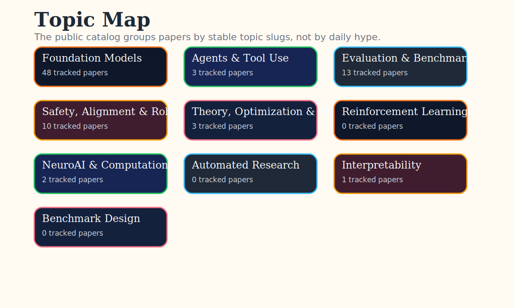

# AI Paper Radar

I built this as my personal research radar: a way to stay updated on AI papers without getting buried under the daily arXiv avalanche.

The goal is simple: track the papers that look genuinely worth reading, organize them by topic, and keep very short notes on what each paper contributes. It is not a replacement for careful reading; it is my first-pass filter for turning research noise into signal.

I outsource the noise, not the thinking.

<!-- AUTO-GENERATED:RUN_METADATA -->

Last updated: `2026-04-26`
Papers tracked: `80`

## Today’s Top 10

<!-- AUTO-GENERATED:DAILY_TOP10 -->

1. [Agentic World Modeling: Foundations, Capabilities, Laws, and Beyond](catalog/papers/2026-04-26/agentic-world-modeling-foundations-capabilities-laws-and-beyond.md) — agents. As AI systems move from generating text to accomplishing goals through sustained interaction, the ability to model environment dynamics becomes a central bottleneck.
2. [ArmSSL: Adversarial Robust Black-Box Watermarking for Self-Supervised Learning Pre-trained Encoders](catalog/papers/2026-04-26/armssl-adversarial-robust-black-box-watermarking-for-self-supervised-learning-pr.md) — safety alignment. Self-supervised learning (SSL) encoders are invaluable intellectual property (IP).
3. [ATRS: Adaptive Trajectory Re-splitting via a Shared Neural Policy for Parallel Optimization](catalog/papers/2026-04-26/atrs-adaptive-trajectory-re-splitting-via-a-shared-neural-policy-for-parallel-op.md) — agents. Parallel trajectory optimization via the Alternating Direction Method of Multipliers (ADMM) has emerged as a scalable approach to long-horizon motion planning.
4. [SOLAR-RL: Semi-Online Long-horizon Assignment Reinforcement Learning](catalog/papers/2026-04-26/solar-rl-semi-online-long-horizon-assignment-reinforcement-learning.md) — foundation models. As Multimodal Large Language Models (MLLMs) mature, GUI agents are evolving from static interactions to complex navigation.
5. [Learning Evidence Highlighting for Frozen LLMs](catalog/papers/2026-04-26/learning-evidence-highlighting-for-frozen-llms.md) — foundation models. Large Language Models (LLMs) can reason well, yet often miss decisive evidence when it is buried in long, noisy contexts.
6. [SpikingBrain2.0: Brain-Inspired Foundation Models for Efficient Long-Context and Cross-Platform Inference](catalog/papers/2026-04-26/spikingbrain2-0-brain-inspired-foundation-models-for-efficient-long-context-and.md) — foundation models. Scaling context length is reshaping large-model development, yet full-attention Transformers suffer from prohibitive computation and inference bottlenecks at long sequences.
7. [Adversarial Co-Evolution of Malware and Detection Models: A Bilevel Optimization Perspective](catalog/papers/2026-04-26/adversarial-co-evolution-of-malware-and-detection-models-a-bilevel-optimization.md) — safety alignment. Machine learning-based malware detectors are increasingly vulnerable to adversarial examples.
8. [PASR: Pose-Aware 3D Shape Retrieval from Occluded Single Views](catalog/papers/2026-04-26/pasr-pose-aware-3d-shape-retrieval-from-occluded-single-views.md) — safety alignment. Single-view 3D shape retrieval is a fundamental yet challenging task that is increasingly important with the growth of available 3D data.
9. [Structure-Guided Diffusion Model for EEG-Based Visual Cognition Reconstruction](catalog/papers/2026-04-26/structure-guided-diffusion-model-for-eeg-based-visual-cognition-reconstruction.md) — neuroai. Objective: Decoding visual information from electroencephalography (EEG) is an important problem in neuroscience and brain-computer interface (BCI) research.
10. [Generative Modeling of Neurodegenerative Brain Anatomy with 4D Longitudinal Diffusion Model](catalog/papers/2026-04-26/generative-modeling-of-neurodegenerative-brain-anatomy-with-4d-longitudinal-diff.md) — neuroai. Understanding and predicting the progression of neurodegenerative diseases remains a major challenge in medical AI, with significant implications for early diagnosis, disease moni…

## Topic Map

<!-- AUTO-GENERATED:TOPIC_INDEX -->

- [Foundation Models](catalog/topics/foundation_models/README.md) — 48 tracked papers
- [Agents & Tool Use](catalog/topics/agents/README.md) — 3 tracked papers
- [Evaluation & Benchmarks](catalog/topics/evaluation/README.md) — 13 tracked papers
- [Safety, Alignment & Robustness](catalog/topics/safety_alignment/README.md) — 10 tracked papers
- [Theory, Optimization & Statistical Learning](catalog/topics/theory_optimization/README.md) — 3 tracked papers
- [Reinforcement Learning](catalog/topics/reinforcement_learning/README.md) — 0 tracked papers
- [NeuroAI & Computational Neuroscience](catalog/topics/neuroai/README.md) — 2 tracked papers
- [Automated Research](catalog/topics/automated_research/README.md) — 0 tracked papers
- [Interpretability](catalog/topics/interpretability/README.md) — 1 tracked papers
- [Benchmark Design](catalog/topics/benchmarks/README.md) — 0 tracked papers

## How this works

Every day, a small pipeline checks paper sources, research feeds, and public research signals. It deduplicates papers, scores them by relevance and interestingness, saves selected metadata and PDFs locally, and publishes short public notes for the best items.

## Caveat

These are quick notes, not peer review. If something looks important, read the paper.

## Copyright

This repository publishes links, original summaries, and original generated visuals. PDFs, private reading artifacts, and figure reuse without clear permission stay out of the public catalog by default.

