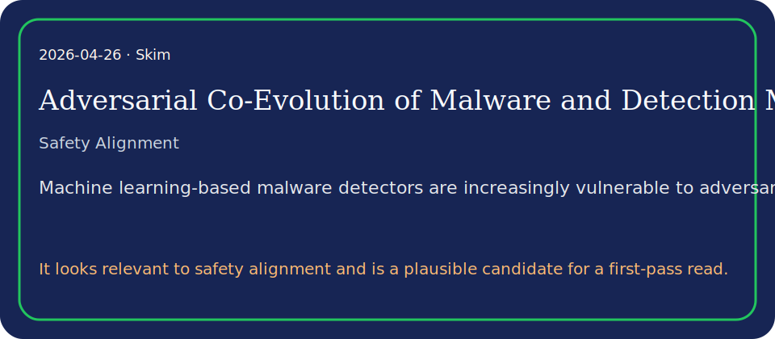

# Adversarial Co-Evolution of Malware and Detection Models: A Bilevel Optimization Perspective

## TL;DR

This paper proposes a robust defense framework based on bilevel optimization, explicitly modeling the strategic interaction between a defender and an attacker as an adversarial co…

## What it contributes

- This paper proposes a robust defense framework based on bilevel optimization, explicitly modeling the strategic interaction between a defender and an attacker as an adversarial co-evolutionary process.
- We evaluate our approach using the MAB-malware framework against three distinct malware families: Mokes, Strab, and DCRat.
- It looks relevant to safety alignment and is a plausible candidate for a first-pass read.

## Key results

- Furthermore, the iterative framework significantly increases the attacker's query complexity, raising the average cost of successful evasion by up to two orders of magni…

## Method in brief

We evaluate our approach using the MAB-malware framework against three distinct malware families: Mokes, Strab, and DCRat.

## Caveats

Fast note from local PDF text. Verify claims and limitations directly in the paper.

## Links

- Paper: http://arxiv.org/abs/2604.22569v1
- PDF: https://arxiv.org/pdf/2604.22569v1
- Code/project: 
