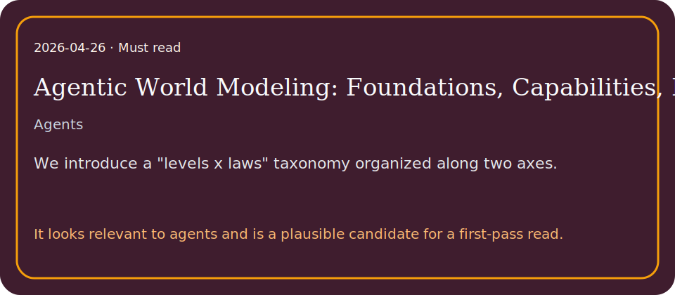

# Agentic World Modeling: Foundations, Capabilities, Laws, and Beyond

## TL;DR

As AI systems move from generating text to accomplishing goals through sustained interaction, the ability to model environment dynamics becomes a central bottleneck.

## What it contributes

- Agents that manipulate objects, navigate software, coordinate with others, or design experiments require predictive environment models, yet the term world mode…
- We introduce a "levels x laws" taxonomy organized along two axes.
- The first defines three capability levels: L1 Predictor, which learns one-step local transition operators; L2 Simulator, which composes them into multi-step, a…

## Key results

- Agents that manipulate objects, navigate software, coordinate with others, or design experiments require predictive environment models, yet the term world mode…
- We introduce a "levels x laws" taxonomy organized along two axes.
- The first defines three capability levels: L1 Predictor, which learns one-step local transition operators; L2 Simulator, which composes them into multi-step, a…

## Method in brief

As AI systems move from generating text to accomplishing goals through sustained interaction, the ability to model environment dynamics becomes a central bottleneck.

## Caveats

Summary based on abstract/metadata only.

## Links

- Paper: http://arxiv.org/abs/2604.22748v1
- PDF: https://arxiv.org/pdf/2604.22748v1
- Code/project: 
