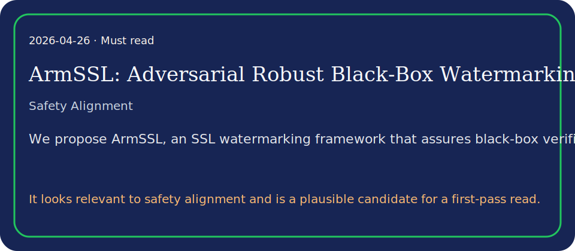

# ArmSSL: Adversarial Robust Black-Box Watermarking for Self-Supervised Learning Pre-trained Encoders

## TL;DR

Self-supervised learning (SSL) encoders are invaluable intellectual property (IP).

## What it contributes

- However, no existing SSL watermarking for IP protection can concurrently satisfy the following two practical requirements: (1) provide ownership verification c…
- We propose ArmSSL, an SSL watermarking framework that assures black-box verifiability and adversarial robustness while preserving utility.
- For verification, we introduce paired discrepancy enlargement, enforcing feature-space orthogonality between the clean and its watermark counterpart to produce…

## Key results

- However, no existing SSL watermarking for IP protection can concurrently satisfy the following two practical requirements: (1) provide ownership verification c…
- We propose ArmSSL, an SSL watermarking framework that assures black-box verifiability and adversarial robustness while preserving utility.
- For verification, we introduce paired discrepancy enlargement, enforcing feature-space orthogonality between the clean and its watermark counterpart to produce…

## Method in brief

However, no existing SSL watermarking for IP protection can concurrently satisfy the following two practical requirements: (1) provide ownership verification capability under black-box suspect model access once the stol…

## Caveats

Summary based on abstract/metadata only.

## Links

- Paper: http://arxiv.org/abs/2604.22550v1
- PDF: https://arxiv.org/pdf/2604.22550v1
- Code/project: 
