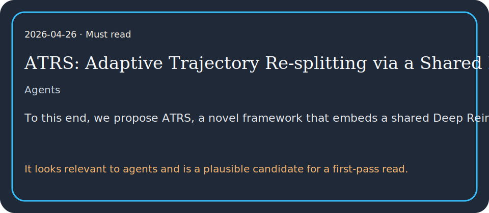

# ATRS: Adaptive Trajectory Re-splitting via a Shared Neural Policy for Parallel Optimization

## TL;DR

To this end, we propose ATRS, a novel framework that embeds a shared Deep Reinforcement Learning policy into the parallel ADMM loop.

## What it contributes

- To this end, we propose ATRS, a novel framework that embeds a shared Deep Reinforcement Learning policy into the parallel ADMM loop.
- Parallel trajectory optimization via the Alternating Direction Method of Multipliers (ADMM) has emerged as a scalable approach to long-horizon motion planning.
- It looks relevant to agents and is a plausible candidate for a first-pass read.

## Key results

- To mitigate this, recent solvers exploit specific problem structures to achieve linear time complexityO(N).
- Existing L2O methods have achieved notable progress in parameter tuning and solver warm-starting for problems with fixed dimensions.
- Benchmarks and real-world experiments validate that the lightweight policy enables faster convergence and real-time onboard deployment without sim-to-real degradation.

## Method in brief

Parallel trajectory optimization via the Alternating Direction Method of Multipliers (ADMM) has emerged as a scalable approach to long-horizon motion planning.

## Caveats

However, existing frameworks typically decompose the problem into parallel subproblems based on a predefined fixed structure.

## Links

- Paper: http://arxiv.org/abs/2604.22715v1
- PDF: https://arxiv.org/pdf/2604.22715v1
- Code/project: 
