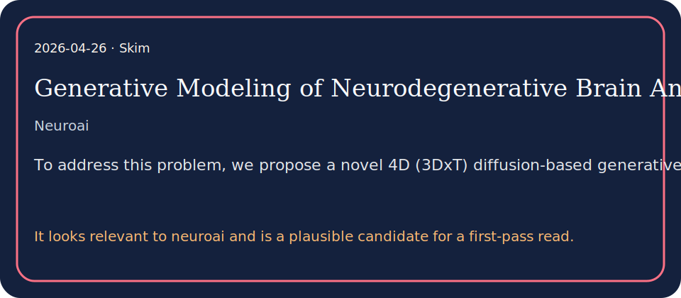

# Generative Modeling of Neurodegenerative Brain Anatomy with 4D Longitudinal Diffusion Model

## TL;DR

To address this problem, we propose a novel 4D (3DxT) diffusion-based generative framework that effectively models and synthesizes longitudinal brain anatomy over time, conditione…

## What it contributes

- To address this problem, we propose a novel 4D (3DxT) diffusion-based generative framework that effectively models and synthesizes longitudinal brain anatomy over time, conditioned on available clinical variables such a…
- We validate our model through both synthetic sequence generation and downstream longitudinal disease classification, as well as brain segmentation.
- It looks relevant to neuroai and is a plausible candidate for a first-pass read.

## Key results

- Experimental results demonstrate that our method excels at generating longitudinal sequences with preserved anatomical structure and shape, outperforming state-of-theart…

## Method in brief

We validate our model through both synthetic sequence generation and downstream longitudinal disease classification, as well as brain segmentation.

## Caveats

Understanding and predicting the progression of neurodegenerative diseases remains a major challenge in medical AI, with significant implications for early diagnosis, disease monitoring, and treatment planning.

## Links

- Paper: http://arxiv.org/abs/2604.22700v1
- PDF: https://arxiv.org/pdf/2604.22700v1
- Code/project: 
