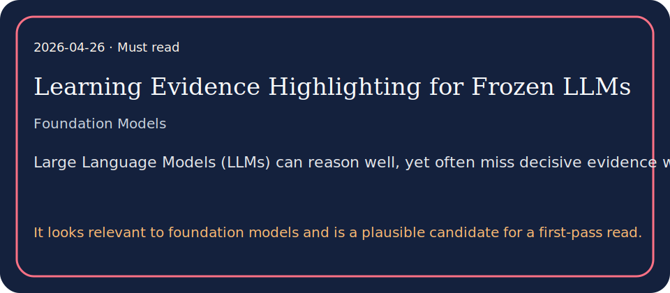

# Learning Evidence Highlighting for Frozen LLMs

## TL;DR

We introduce HiLight, an Evidence Emphasis framework that decouples evidence selection from reasoning for frozen LLM solvers.

## What it contributes

- We introduce HiLight, an Evidence Emphasis framework that decouples evidence selection from reasoning for frozen LLM solvers.
- We introduceHiLight, anEvidence Emphasis frameworkthat decouples evidence selectionfromreasoningforfrozenLLM solvers.HiLightavoids compressing or rewriting the input, which can discard or distort evidence, by training a lightweightEmphasis…
- It looks relevant to foundation models and is a plausible candidate for a first-pass read.

## Key results

- Across sequential recommendation and long-context question answering,HiLightconsistently improves performance over strong prompt-based and automated prompt-optimization…
- Under what regimes does explicit highlighting improve long-context performance, versus being neutral?
- The key operational challenge is that “important evidence” is typically latent and task dependent: most benchmarks provide only an input and an outcome label, not ground…

## Method in brief

We introduceHiLight, anEvidence Emphasis frameworkthat decouples evidence selectionfromreasoningforfrozenLLM solvers.HiLightavoids compressing or rewriting the input, which can discard or distort evidence, by training a lightweightEmphasis…

## Caveats

Empirical studies have documented this failure mode, including the “Lost in the Middle” effect, where models attend less reliably to information that is neither near the beginning nor the end of a long input Liu et al.…

## Links

- Paper: http://arxiv.org/abs/2604.22565v1
- PDF: https://arxiv.org/pdf/2604.22565v1
- Code/project: 
