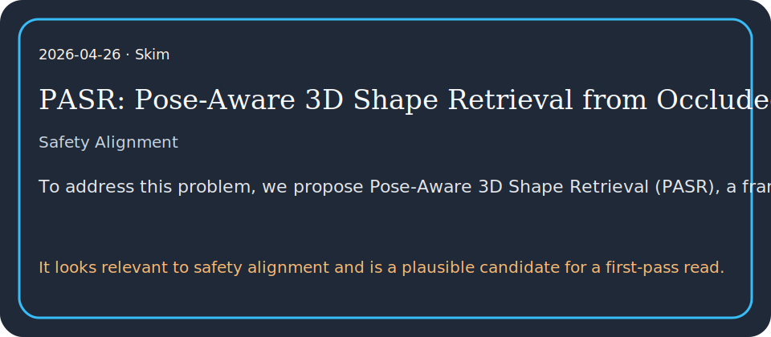

# PASR: Pose-Aware 3D Shape Retrieval from Occluded Single Views

## TL;DR

To address this problem, we propose Pose-Aware 3D Shape Retrieval (PASR), a framework that formulates retrieval as a feature-level analysis-by-synthesis problem by distilling know…

## What it contributes

- To address this problem, we propose Pose-Aware 3D Shape Retrieval (PASR), a framework that formulates retrieval as a feature-level analysis-by-synthesis problem by distilling knowledge from a 2D foundation model (DINOv3…
- Existing approaches largely fall into two categories: those using contrastive learning to map point cloud features into existing vision-language spaces and those that learn a common embedding space for 2D images and 3D shapes.
- It looks relevant to safety alignment and is a plausible candidate for a first-pass read.

## Key results

- PASR substantially outperforms existing methods on both clean and occluded 3D shape retrieval datasets by a wide margin.

## Method in brief

Existing approaches largely fall into two categories: those using contrastive learning to map point cloud features into existing vision-language spaces and those that learn a common embedding space for 2D images and 3D shapes.

## Caveats

However, these feed-forward, holistic alignments are often difficult to interpret, which in turn limits their robustness and generalization to real-world applications.

## Links

- Paper: http://arxiv.org/abs/2604.22658v1
- PDF: https://arxiv.org/pdf/2604.22658v1
- Code/project: 
