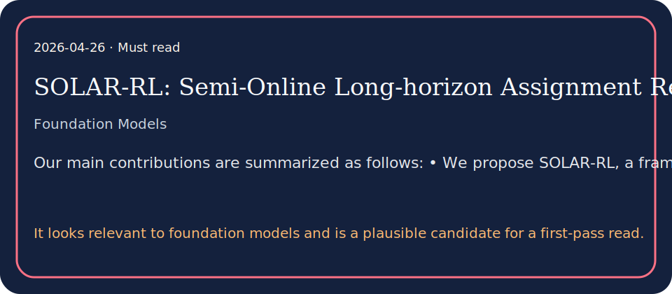

# SOLAR-RL: Semi-Online Long-horizon Assignment Reinforcement Learning

## TL;DR

As Multimodal Large Language Models (MLLMs) mature, GUI agents are evolving from static interactions to complex navigation.

## What it contributes

- While Reinforcement Learning (RL) has emerged as a promising paradigm for training MLLM agents on dynamic GUI tasks, its effective application faces a dilemma.
- Standard Offline RL often relies on static step-level data, neglecting global trajectory semantics such as task completion and execution quality.
- Conversely, Online RL captures the long-term dynamics but suffers from high interaction costs and potential environmental instability.

## Key results

- While Reinforcement Learning (RL) has emerged as a promising paradigm for training MLLM agents on dynamic GUI tasks, its effective application faces a dilemma.
- Standard Offline RL often relies on static step-level data, neglecting global trajectory semantics such as task completion and execution quality.
- Conversely, Online RL captures the long-term dynamics but suffers from high interaction costs and potential environmental instability.

## Method in brief

As Multimodal Large Language Models (MLLMs) mature, GUI agents are evolving from static interactions to complex navigation.

## Caveats

Summary based on abstract/metadata only.

## Links

- Paper: http://arxiv.org/abs/2604.22558v1
- PDF: https://arxiv.org/pdf/2604.22558v1
- Code/project: 
