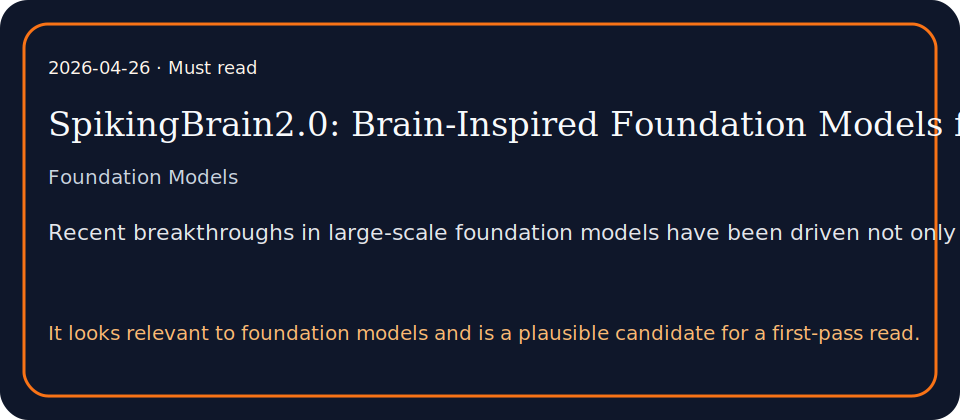

# SpikingBrain2.0: Brain-Inspired Foundation Models for Efficient Long-Context and Cross-Platform Inference

## TL;DR

Scaling context length is reshaping large-model development, yet full-attention Transformers suffer from prohibitive computation and inference bottlenecks at long sequences.

## What it contributes

- A key challenge is to design foundation models that maintain performance and long-context efficiency with minimal training overhead.
- We introduce SpikingBrain2.0 (SpB2.0), a 5B model that advances both architecture and training efficiency of its predecessor.
- Our contributions are two-fold. (1) Architectural Innovation: We propose Dual-Space Sparse Attention (DSSA), an inter-layer hybrid of Sparse Softmax Attention…

## Key results

- A key challenge is to design foundation models that maintain performance and long-context efficiency with minimal training overhead.
- We introduce SpikingBrain2.0 (SpB2.0), a 5B model that advances both architecture and training efficiency of its predecessor.
- Our contributions are two-fold. (1) Architectural Innovation: We propose Dual-Space Sparse Attention (DSSA), an inter-layer hybrid of Sparse Softmax Attention…

## Method in brief

Scaling context length is reshaping large-model development, yet full-attention Transformers suffer from prohibitive computation and inference bottlenecks at long sequences.

## Caveats

Summary based on abstract/metadata only.

## Links

- Paper: http://arxiv.org/abs/2604.22575v1
- PDF: https://arxiv.org/pdf/2604.22575v1
- Code/project: 
