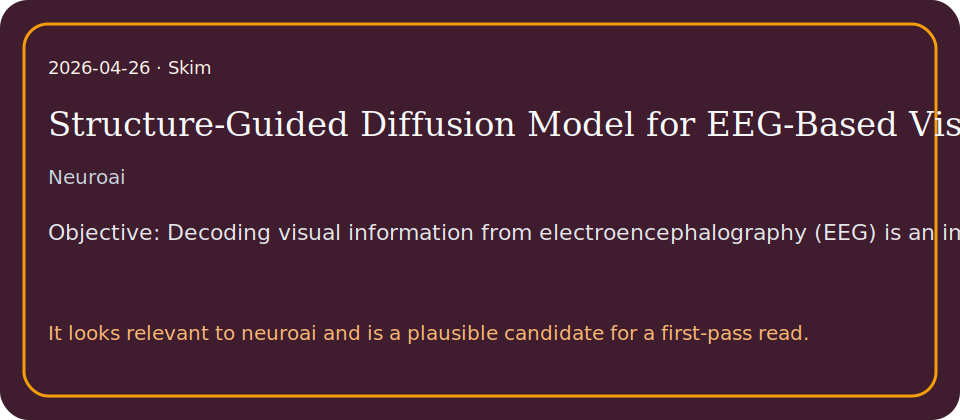

# Structure-Guided Diffusion Model for EEG-Based Visual Cognition Reconstruction

## TL;DR

We propose a Structure-Guided Diffusion Model (SGDM) that incorporates explicit structural information for EEG-based visual reconstruction.

## What it contributes

- We propose a Structure-Guided Diffusion Model (SGDM) that incorporates explicit structural information for EEG-based visual reconstruction.
- 1), a unified framework for EEG-based visual cognition reconstruction.
- It looks relevant to neuroai and is a plausible candidate for a first-pass read.

## Key results

- Results: SGDM outperforms existing methods on both abstract and natural image datasets.
- Reconstructed images achieve higher fidelity in low-level visual features and semantic representations, indicating improved decoding accuracy and strong generalization a…
- This supports BCIs with increased degrees of freedom for intention decoding and more flexible brain-to-machine communication.

## Method in brief

1), a unified framework for EEG-based visual cognition reconstruction.

## Caveats

However, the low signal-to-noise ratio, significant inter-individual variability, and complex associations among hierarchical visual semantics make it challenging to reconstruct images that humans “see” from EEG signals…

## Links

- Paper: http://arxiv.org/abs/2604.22649v1
- PDF: https://arxiv.org/pdf/2604.22649v1
- Code/project: 
